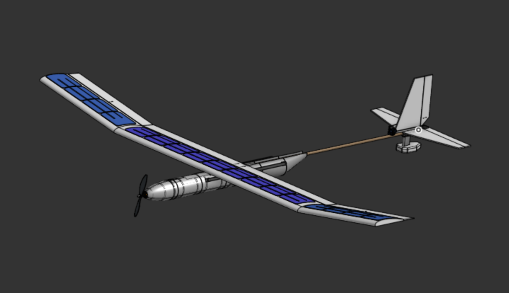
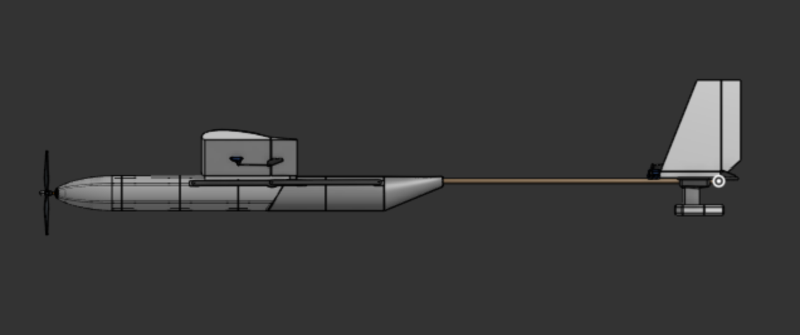
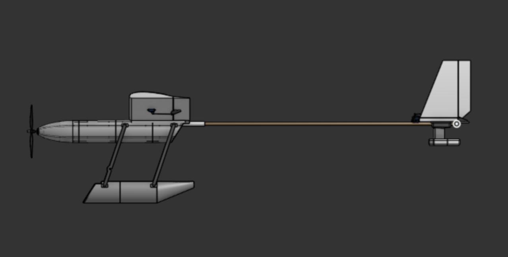
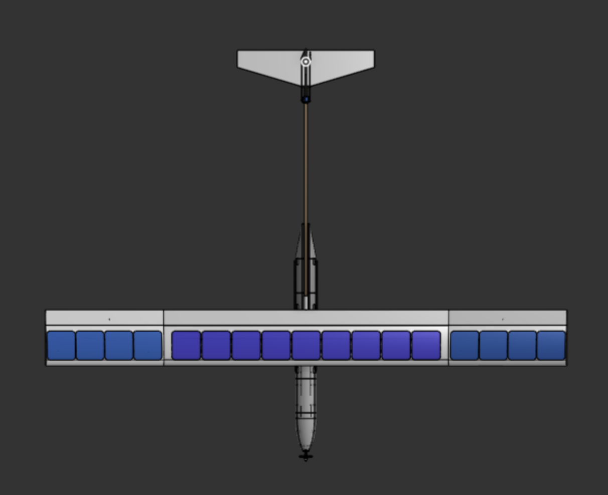
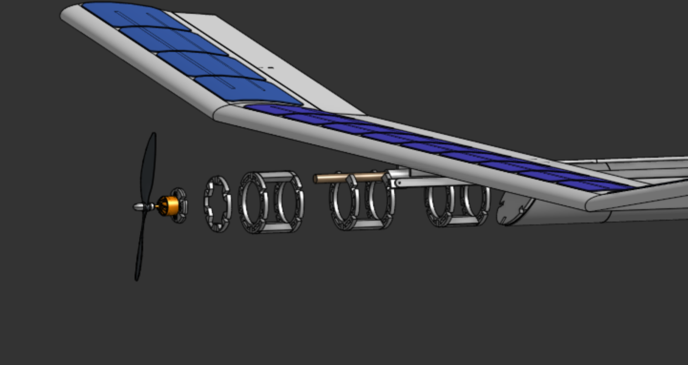

# Project Albatross

The goal for the project was to create an autonomous plane capable of flying for hours off of solar power. Another big aspect is the ability to takeoff from water using a pontoon system mounted to a 4-bar linkage. The plane is going to be made from foam board and 3d prints. The wingspan is 90in and the length is roughly 6ft. 

## Motivation
We wanted to explore the idea of multi-hour flight using solar power. Most rc planes have a relatively short flight time, but we wanted to try and expand on that. That is why we also added the pontoons, so it could recharge on the surface of water.

## Design

### Pontoons
The pontoon mechanism works by having two hollow 3D printed hulls swing out when landing. The reason we decided to put them on a swinging mechanism was that it would greatly reduce drag, and in turn air resistance. Just based on frontal area that's around a 25% increase in efficiency. They will be driven by a motor that will winch it up or down.

### Solar Panels
The solar panels just sit on the wing and will be wired to an MPPT board. They each generate around 3.5W in full sun, and there will be 17. It should be enough to sustain flight, but it will almost never get perfect lighting, so we will see. These sit on a 90in wing that has an 7in chord (not including the ailerons). Panels measure 125mm, so roughly 5in.

### Hull
Used a series of ribs inside to support a really thin outer shell of 3D print. These will slide down into their corresponding spots, making the structure much stronger. The front one also serves as the motor mount too.

