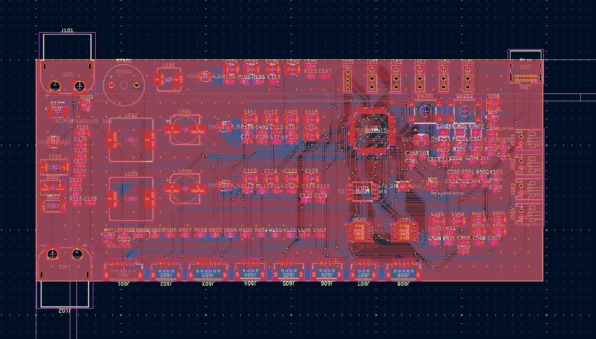
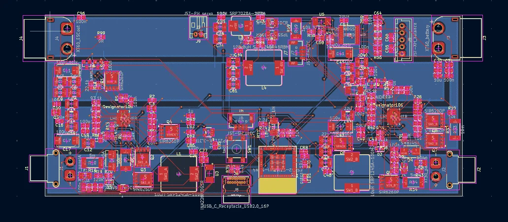

# Project Albatross

The goal for the project was to create an autonomous plane capable of flying for hours off of solar power. Another big aspect is the ability to takeoff from water using a pontoon system mounted to a 4-bar linkage. The plane is going to be made from foam board and 3d prints. The wingspan is 90in and the length is roughly 6ft. 

https://cad.onshape.com/documents/cb4d8119196719dc9005cd1f/w/a50220c0795171ae93763f3d/e/ee41d6fe8c21d3f854f1676d?renderMode=0&uiState=6aa1fe8d3db98abb8ad60905

## Motivation
We wanted to explore the idea of multi-hour flight using solar power. Most rc planes have a relatively short flight time, but we wanted to try and expand on that. That is why we also added the pontoons, so it could recharge on the surface of water.

## Design

### Pontoons
The pontoon mechanism works by having two hollow 3D printed hulls swing out when landing. The reason we decided to put them on a swinging mechanism was that it would greatly reduce drag, and in turn air resistance. Just based on frontal area that's around a 25% increase in efficiency. They will be driven by a motor that will winch it up or down.

### Solar Panels
The solar panels just sit on the wing and will be wired to an MPPT board. They each generate around 3.5W in full sun, and there will be 17. It should be enough to sustain flight, but it will almost never get perfect lighting, so we will see. These sit on a 90in wing that has an 7in chord (not including the ailerons). Panels measure 125mm, so roughly 5in.

### Hull
Used a series of ribs inside to support a really thin outer shell of 3D print. These will slide down into their corresponding spots, making the structure much stronger. The front one also serves as the motor mount too.

## PCB
### Flight Controller
The flight controller was built with Ardupilot in mind, with multiple connectors allowing for different sensors to be modular and  swapped out. It is designed to take a 3 or 4S battery, and runs on an STM32F405RGT6. We are planning on using a GPS and a magnetometer but we have extra connector for different sensors if we want to add them going forward. We also have an IMU and pressure sensor on the board.

### MPPT Board
We made a full solar circuit, with a MPPT board and BMI. With this plane design we kept the wings relatively small. Only 17 solar panels could fit. With each solar panel proving roughly 0.6V the total voltage was roughly 10V. This is well below the standard voltage of a 4s battery, thus we needed a step up MPPT board. The market for this is miniscule and expensive leading our design to be useful as it functioned as both a step up and step down board depending on the solar array. However, our board also ended up being far to expensive to become justifiable. We decided to pivot to using a standard step down MPPT and increasing the solar area, as well as deceasing the battery voltage to a 3S.

## Assembly 

### The Plane
Most of the planes assembly consists of techniques similar to other rc planes. The wings are made from foam board "wrapped" around a dowel spar. They are made by cutting 3 slits across a sheet of foam board spaced out at 7in, 8iin, and 17 from one end. Then the paper layer of the foam board is peeled off for the top of the airfoil to create a better curve. The foam board is folded over the wing spar and three sections of these are connected.

The body is made from a dowel as the main structure of the hull, with 3d printed shells for aerodynamics and part containers. The slide onto the dowel and will be hot glued into place. Then the electronics are wired and placed into the nose cone of the 3d printed hull. The pontoons can then be mounted on they're hinges, which will be connected to n20 motor to swing up and down.
Solar panels will be mounted on the wing using a plastic wrap to hold them in place, while still allowing sunlight through.

### The PCB
Both the pcbs, especially the mppt board, are rather complex and have a lot of smd soldering. The use of a hot plate will be need and following the design the components will be soldered on. These boards will then be wired and hooked up to the rest of the planes electronics.

## BOM

| Description                                                  | Quantity |    Price | Link                                                                                                                                                                                                                                                                                                                                                                                                                                                                                                                                                                                                                                                                    |
| ------------------------------------------------------------ | -------: | -------: | ----------------------------------------------------------------------------------------------------------------------------------------------------------------------------------------------------------------------------------------------------------------------------------------------------------------------------------------------------------------------------------------------------------------------------------------------------------------------------------------------------------------------------------------------------------------------------------------------------------------------------------------------------------------------- |
| Main Brushless Motor                                         |        0 |    19.98 | [View](https://www.amazon.com/D2830-Brushless-Multi-Copter-Fixed-Wing-Helicopters/dp/B0D3DTQCS6?crid=1GIDDJS7T4YGM&dib=eyJ2IjoiMSJ9.AtVN6vy-8eWpAr1MRXuwIyZDgROcZ_Tzuz1vBoY-LQgoGHMikw6Aqbtr0vY9_g7-KdBo8Uc5qtG9Z2M4y7HJNJ-4DeF8kwkHgLJEmAUFDxmb91PZrz4W3htgwBpbw4BqP0INFkJTwgfE83IHLo2A6Yt1P7s4NWxooXJ_7hyRbZfiLSRV9Om79zQwpNE-6LewTQ_vMCWp6zsd65cN0q3pzUgZFKQl49tTeJsKrsUk_vwhCnAS4FoziM5t2XskwUUXPg0w_hbD3VEKizfJy3LNRxQ9HERiJKMdJODfD9-f40Y.mDKjGPO2-bY4kN_1C4PMB4SJw4Vj_UEMF7pvPhxdHXQ&dib_tag=se&keywords=4s%2Bbrushless%2Bmotor&qid=1787538403&s=industrial&sprefix=4s%2Bbrushless%2Bmoto%2Cindustrial%2C144&sr=1-24&th=1)                                       |
| Propeller                                                    |        0 |     9.19 | [View](https://www.amazon.com/FOCMKEAS-Propeller-Control-Quadcopter-Propellers/dp/B0F7LGSVNX?dib=eyJ2IjoiMSJ9.A6pEEgKzE0xpVNJD1XzkBh2nzCzQmoNq3ytnVg6CN18DSJCYAb_vIOQs6C8UpuIxUIBGOFXvnDEB_UkNs5OgI2uLLwH9465pMMq5V0m_Dc9-5lnfrtW4XxR0hVYtef-Q3eX9Ex-b_6jeFyqg4qao58oj_oSJQ67rCSTJcOPaGaEuolYwWYajsof5d2b4Q7oDYOMhOJqfl2KeGGB-YOsVRt_N_G7Wvj5ITrCs1dr519pMPs-xR864BLOs0i2SqKWhch3QZd_lyTU7AmSTrIm3AY6-M7YS4UeShy5_y6pB76uU.ozcTE64lZMBamYODjHXiUzZvMs33qJ17Fo1byxuyLn0&dib_tag=se&keywords=10x7%2Bpropeller&qid=1787538510&sr=8-9&th=1)                                                                                                                                 |
| Light Weight PLA                                             |        1 |    29.99 | [View](https://www.amazon.com/Polymaker-PolyLite-LW-PLA-1-75mm-800g/dp/B09H2SC1CX?crid=2132M6YWZ9EGL&dib=eyJ2IjoiMSJ9.EbFv4lznFsPcWRDS9TjkviMWlq_K4jqpkA8IQc7o2zDEebKpblPqLRmth953MziS7uqHudJ0SZ3s5wBnAt_yUrxKvtQmWUkzZDUHRLlRxhPQMmJGF5JgJkjI19orItGwAG-fORcVH57sKaYh6ABwSmNhR0hW-JCWFJVTA7df6mxN11L5wEezJSx71Ra0gn5ADS7o05-v34wEVmZvxTj3QMUajjPENJMn1u_jx4HQ0n0.XZf55xAyfc2s93rCVnJll9koOeH9xDjBtNictLozpg4&dib_tag=se&keywords=pla%2Baero&qid=1787525308&sprefix=pla%2Baero%2Caps%2C175&sr=8-2&th=1)                                                                                                                                                                 |
| Solar Panels                                                 |       30 |        4 | [View](https://www.ebay.com/itm/382873833299?_trksid=p2332490.c101224.m-1&var=651906635231)                                                                                                                                                                                                                                                                                                                                                                                                                                                                                                                                                                             |
| Servos (5 Pack)                                              |        1 |    15.99 | [View](https://www.amazon.com/dp/B0BWJ2CK9D?_encoding=UTF8&th=1)                                                                                                                                                                                                                                                                                                                                                                                                                                                                                                                                                                                                        |
| Servo Extention Cables                                       |        1 |     9.99 | [View](https://www.amazon.com/ACEIRMC-Extension-Connector-Airplanes-Control/dp/B0CP7FRV31?crid=208A8HM7J7RMB&dib=eyJ2IjoiMSJ9.zvspaGyYEhj8FE188_ucmxEkKO9qxdxkeWBVjVOxg_IdOeuFNdGl7vn5_YA_3SkekBpo1C4ZVZeYne-sWa-vqcT14DQGpfkZP0DvSsxYqCkKgQiqMDOEiCSFFEm6DgK3rqWCAZoQL5KlCa5mTqUZ2ex7WquiyLc5CjRFcVyx7MRTT2iRXcr1xalmlWvPcaOSW3QRbxB1vWPW9z5XEMp2abnEaBUddNU7IUBYtHoYaUeh_4k-P5CyB4RuSx_zgH8jz7q1C9rbM7gXJz2oLb_1u9YX6dsfYdR8L4PDelta2Ic.q6GoTBJ_aluZ2bmCM-GL7KpXotR3rhAZuRiR03xYp-Y&dib_tag=se&keywords=servo%2Bextension%2Bcable%2B3ft&qid=1787525999&sprefix=servo%2Bextension%2Bcable%2B3ft%2Caps%2C156&sr=8-2&th=1)                                               |
| 3S Lipo                                                      |        0 |    16.99 | [View](https://www.amazon.com/2200mAh-Connector-Airplane-Quadcopter-Helicopter/dp/B08CZF373Y?dib=eyJ2IjoiMSJ9.qVFbEjwkpjGPTIbNqqaG4vhhEhuTYIhbIrznxJf2mWbGQFAQZzQvMC-RFV3-_m0Y3fUMGU2WUniptrScL0GNg0JNWvpu92oegfyhtbsOfVlIXlQ-MSGKUgVLKmpeuwx3UI1lsvJuu8vqa-Yaq4HsqnQAZZ_Rz_IvS5CB1vaPLZo0VIJ8n6EhUtJ7-DbkXdtaIhPBBi96NDbnM-Gm8rh9aLTVWOSHBg1nrYiUrKQ3GgO3EjhKp2QWHQe2iZsrDUKseEFkoB9d_mDGmAwJTdDD2BOaxg-PfcvtzBMpGu8Q-8.kPC3qnyTph9ywtksvaFng7sRWRmlsHQLAdpGe4SUKuI&dib_tag=se&keywords=3s%2Blipo%2Bbattery%2B2200mah%2Bturnigy&qid=1788917182&sr=8-5&th=1)                                                                                                            |
| ESC                                                          |        0 |     28.4 | [View](https://www.amazon.com/60A-Brushless-Fixed-Wing-Aircraft-Helicopter/dp/B0FRM7X984?crid=3PJRS2ICQ8PJD&dib=eyJ2IjoiMSJ9.l-i8O1etdcDAwANXbMuoWiZWPcCDAv0Sbts3AtoG4644KeM131bYEzrw-p2MOpDivXIBVtqrIHys9zYjqJ12LKnK6i-6AH8XN9EJTKXhXk6bnEsInO310qC9xtRnb-KxAyLtBdO-nKIXAzmh6S25dI1q8qE13uXMczSF6lAoa4Z5NEnQ1c-VgTorYn7Om1HT8OKtg7QFZ9L8LORe08OILE3gtEbHjzeyqic_LyjKrPWg9aB3qZkXp0HWgDVTno_lIJrRG5CHcl-eH1EkQ6-XxLoF0CTAm4u7tXZE4JOihRc.F29bWjkF8PrGOvVfpu0PWkPe3OBKBhs2UlFD32E6XW8&dib_tag=se&keywords=60A%2Besc&qid=1787538359&sprefix=60a%2Bes%2Caps%2C204&sr=8-4&th=1)                                                                                             |
| Heat Set Inserts                                             |        1 |     4.99 | [View](https://www.amazon.com/Aoserge-100Pcs-Brass-Heat-Inserts/dp/B0FM45X5TD?crid=18SC6KZP9OQV&dib=eyJ2IjoiMSJ9.yMovo3L8gJsoYK8w4IEzTWAA8Pa8BA9cJIQ-iAF8utzPJ714NxCnewEAb7-vQQ4wjrNfGFI7i-OyntuQi7irDqRP6uR-vwBS8VsjYbYfnEGw1HEHWc_urtRw7aOZabJ8nMm7X1PGJRnSm_dumVbfvMLHscQXXEKbt6OXNfPWSSik5vOfFX9qPY9pHfWj4SHEL0ygbkMKETaEilfUxx_5VjPdDVNT5e97h0AJBQlPIaQ.5RN2Lr60uWhE16Ea_KMSffw7Fy3fc5X4_u3aus6Fmds&dib_tag=se&keywords=heat%2Bset%2Binserts&qid=1788233777&refinements=p_36%3A-1000&rnid=386419011&sprefix=heat%2Bset%2Binsert%2Caps%2C177&sr=8-8&th=1)                                                                                                           |
| M3 Screws                                                    |        1 |     6.99 | [View](https://www.amazon.com/Machine-Assorted-Assortment-Stainless-Threaded/dp/B0DFWX8F36?crid=2IMXPAP1DEIAP&dib=eyJ2IjoiMSJ9.yZ4b1PXj7_4Gv5y9TnkcPHKxO-JQ9HyV9zOqDs1Fm5YNqA9myOSVzQR86Kytn6L07abLABHcaVdUCsevvHmGTXOa28JjPYt_5xii7wxPjRW9afO-sCb8yxQ4SSXCAAmo9bffwnMVAzJu2TboclRhZvmMOorqYb0dWacgTGgbutoSSJYu1r2_nygjP9LcBysSyQC3k7f4e7l_HnsZ61rrlNLoYdkTnklYXdqPEj5ZLEU.NHmRGP9EbYvQucNLRHm8Z_QKjKLUAvDfJK4pTsFrj0Y&dib_tag=se&keywords=m3%2Bscrews&qid=1787538716&refinements=p_36%3A-1000&rnid=2661611011&sprefix=m3%2Bscrew%2Caps%2C168&sr=8-9&th=1)                                                                                                              |
| Controller                                                   |        0 |    54.89 | [View](https://www.amazon.com/FLYSKY-Transmitter-Controller-Receiver-Upgrade/dp/B07Z8VCB45?crid=31XOXYXMOF57J&dib=eyJ2IjoiMSJ9.oYVOZgIKCn7QHiQW_sPBdqCzg8t7x423ixB_IW4cyeVR8NzFLb4Va8IOe6aXXys3DgsJLeYg0AZj4C6nYi5yfUcnhJPpvlJfRvaaQPgnwUMt_mnDe2qD3gG-DdXs-hZiZr7JC06yUwYZu2FwEhZMYXUMUlfIZ3HLRCX-9MHtBgzPtYGTfMZA61y8FiqHdAbDZFId_eyTI-cYJqWUszTLyqKt7BXOan2ybAT59q5ePnzmNrsKFerFJt5INTKZUfP-MXZW1UjR8EVU4ZrsCfYvvbbefuqou7SJWZUwxCtYB74.GyGO-L0K5NV1BGEOLjfxkipUgwNBX3knqvS8UBxhQLE&dib_tag=se&keywords=fly+sky+controller&qid=1787538836&sprefix=fly+sky+co%2Caps%2C176&sr=8-1)                                                                                     |
| Foam Board                                                   |       10 |     1.25 | [View](https://www.dollartree.com/readi-board-white-foam-boards/809955)                                                                                                                                                                                                                                                                                                                                                                                                                                                                                                                                                                                                 |
| N20 Motor                                                    |        4 |     4.17 | [View](https://www.aliexpress.us/item/3256803908995996.html?spm=a2g0o.productlist.main.1.204626f5A7Jdmy&algo_pvid=8b3a0dbe-85eb-467c-8fe9-f87f66337553&algo_exp_id=8b3a0dbe-85eb-467c-8fe9-f87f66337553-0&pdp_ext_f=%7B%22order%22%3A%221694%22%2C%22eval%22%3A%221%22%2C%22fromPage%22%3A%22search%22%7D&pdp_npi=6%40dis%21USD%213.68%210.99%21%21%213.68%210.99%21%40210328c017889213388988109e0e7d%2112000028016789215%21sea%21US%210%21ABX%211%210%21n_tag%3A-29910%3Bd%3Ac2c1a869%3Bm03_new_user%3A-29895%3BpisId%3A5000000210782938&curPageLogUid=oM71zmsPOiT8&utparam-url=scene%3Asearch%7Cquery_from%3A%7Cx_object_id%3A1005004095310748%7C_p_origin_prod%3A)   |
| GPS                                                          |        1 |     15.9 | [View](https://robofusion.net/products/mg-a01-gps-module)                                                                                                                                                                                                                                                                                                                                                                                                                                                                                                                                                                                                               |
| Telemetry                                                    |        1 |     65.9 | [View](https://robofusion.net/products/micoair-lr900-p-915mhz-lora-telemetry-radio-for-pixhawk-ardupilot-px4-1w-fhss-flagship-long-range-pair?variant=54111278530879)                                                                                                                                                                                                                                                                                                                                                                                                                                                                                                   |
| BMS                                                          |        1 |     1.13 | [View](https://www.aliexpress.us/item/3256807501448998.html?spm=a2g0o.productlist.main.24.77ec3d62baKU9j&algo_pvid=bad08f0c-8228-4e05-bf4c-bcd4cd963110&algo_exp_id=bad08f0c-8228-4e05-bf4c-bcd4cd963110-21&pdp_ext_f=%7B%22order%22%3A%22928%22%2C%22eval%22%3A%221%22%2C%22fromPage%22%3A%22search%22%7D&pdp_npi=6%40dis%21USD%211.13%210.99%21%21%217.56%216.62%21%402101c4b817889206645041384e0e0f%2112000041841194925%21sea%21US%210%21ABX%211%210%21n_tag%3A-29910%3Bd%3Ac2c1a869%3Bm03_new_user%3A-29895%3BpisId%3A5000000210782938&curPageLogUid=EdmXCWhx64s9&utparam-url=scene%3Asearch%7Cquery_from%3A%7Cx_object_id%3A1005007687763750%7C_p_origin_prod%3A)  |
| MPPT Board                                                   |        1 |    20.41 | [View](https://www.aliexpress.us/item/3256810455381147.html?spm=a2g0o.productlist.main.5.1764tsWXtsWXhf&algo_pvid=96684140-d778-43dc-ac98-f4994373f856&algo_exp_id=96684140-d778-43dc-ac98-f4994373f856-4&pdp_ext_f=%7B%22order%22%3A%2212%22%2C%22eval%22%3A%22%22%2C%22fromPage%22%3A%22search%22%7D&pdp_npi=6%40dis%21USD%2120.41%2113.28%21%21%21136.26%2188.66%21%402101ca9517889202540843342e0eab%2112000053059870601%21sea%21US%210%21ABX%211%210%21n_tag%3A-29910%3Bd%3Ac2c1a869%3Bm03_new_user%3A-29895%3BpisId%3A5000000210782933&curPageLogUid=7y9B1Ewqa6k0&utparam-url=scene%3Asearch%7Cquery_from%3A%7Cx_object_id%3A1005010641695899%7C_p_origin_prod%3A) |
| passive piezo                                                |        5 |   0.4017 | [View](https://www.lcsc.com/product-detail/C128650.html?s_z=n_q_C128650&globalKeyword=C128650)                                                                                                                                                                                                                                                                                                                                                                                                                                                                                                                                                                          |
| 100u/35V poly                                                |       50 |   0.0139 | [View](https://www.lcsc.com/product-detail/C14663.html?s_z=n_q_CC0603KRX7R9BB104&spm=wm.fly.bg.0.xh&lcsc_vid=ElFaA1QDFFgKXlQHFFINU1JeFlZaUF0FQFNdXlUFEgUxVlNeT1ZcVldQRlleXzsOAxUeFF5JWBYZEEoKFBINSQcJGk4%3D)                                                                                                                                                                                                                                                                                                                                                                                                                                                            |
| 100n/50V 0603                                                |       10 |   0.2003 | [View](https://www.lcsc.com/product-detail/Multilayer-Ceramic-Capacitors-MLCC-SMD-SMT_Taiyo-Yuden-TMK325BJ106KN-T_C92834.html)                                                                                                                                                                                                                                                                                                                                                                                                                                                                                                                                          |
| 10u/25V 1210                                                 |       10 |   0.2257 | [View](https://www.lcsc.com/product-detail/C92771.html?s_z=n_q_Taiyo%2520Yuden%2520EMK325BJ226MD-T&spm=wm.fly.bg.0.xh&lcsc_vid=FANdVwJVQgMLV11TTlQPX1UHRlFcBlFQRlEMBFYDE1kxVlNeT1ddUlVRQFZYUDsOAxUeFF5JWBYZEEoKFBINSQcJGk4eFQsCAgIaSgADAwAHC0sLAg0aDggHDgQcSgcDBQADDgdLFAAeBgcPAw4cFEkLGwINShcLE0wdChA5AwAHHgtLDhQKAgpLEgwFVFZTFQtcVVILE0waOCdfRVZZVkoOAwwC)                                                                                                                                                                                                                                                                                                            |
| 22u/16V 1210                                                 |       20 |   0.0291 | [View](https://www.lcsc.com/product-detail/multilayer-ceramic-capacitors-mlcc-smd-smt_cctc-tcc0805x7r105k250ft_C282734.html)                                                                                                                                                                                                                                                                                                                                                                                                                                                                                                                                            |
| 1u 0805                                                      |      100 |    0.005 | [View](https://www.lcsc.com/product-detail/C60474.html)                                                                                                                                                                                                                                                                                                                                                                                                                                                                                                                                                                                                                 |
| 100n 0402                                                    |       10 |   0.0614 | [View](https://www.lcsc.com/product-detail/C132176.html?s_z=n_q_CC0805KKX5R7BB475&spm=wm.fly.bg.0.xh&lcsc_vid=ElFaA1QDFFgKXlQHFFINU1JeFlZaUF0FQFNdXlUFEgUxVlNeT1ZcVldQRlFURFFcVDsOAxUeFF5JWBYZEEoKFBINSQcJGk4NBhADEA4cHktXRlVcSQwSGg0%3D)                                                                                                                                                                                                                                                                                                                                                                                                                               |
| 4.7u 0805                                                    |       50 |   0.0138 | [View](https://www.lcsc.com/product-detail/Multilayer-Ceramic-Capacitors-MLCC-SMD-SMT_1uF-105-10-16V_C93816.html)                                                                                                                                                                                                                                                                                                                                                                                                                                                                                                                                                       |
| 1u 0603                                                      |       50 |   0.0191 | [View](https://www.lcsc.com/product-detail/C23630.html?is_substitute=1&original_product_code=C20241888&original_unit_price=0.1047)                                                                                                                                                                                                                                                                                                                                                                                                                                                                                                                                      |
| 2.2u 0603                                                    |      100 |    0.007 | [View](https://www.lcsc.com/product-detail/C342941.html?s_z=n_q_CGA2B2C0G1H100DT0Y0F&spm=wm.fly.bg.0.xh&lcsc_vid=ElFaA1QDFFgKXlQHFFINU1JeFlZaUF0FQFNdXlUFEgUxVlNeT1ZcVlBTRVBeUDsOAxUeFF5JWBYZEEoKFBINSQcJGk4NBhADEA4cHktXRlVcSQwSGg0%3D)                                                                                                                                                                                                                                                                                                                                                                                                                                |
| 10p 0402                                                     |       10 |   0.0803 | [View](https://www.lcsc.com/product-detail/C96179.html)                                                                                                                                                                                                                                                                                                                                                                                                                                                                                                                                                                                                                 |
| 470u/16V 8x10.5                                              |        5 |   0.2003 | [View](https://www.lcsc.com/product-detail/Multilayer-Ceramic-Capacitors-MLCC-SMD-SMT_Taiyo-Yuden-TMK325BJ106KN-T_C92834.html)                                                                                                                                                                                                                                                                                                                                                                                                                                                                                                                                          |
| 10u 1210                                                     |        5 |   0.1813 | [View](https://www.lcsc.com/product-detail/C318781.html?s_z=n_q_C318781&globalKeyword=C318781)                                                                                                                                                                                                                                                                                                                                                                                                                                                                                                                                                                          |
| 10u/16V 1210                                                 |       20 |     0.04 | [View](https://www.lcsc.com/product-detail/C386014.html?is_substitute=1&lcsc_vid=RAQKXlVQQ1kPUwcDRFRcVlJVT1VfAwVSTgRfUVVSRlkxVlNeQVVdVVVVQFFXUDtW&original_product_code=C363943&original_unit_price=0.0898)                                                                                                                                                                                                                                                                                                                                                                                                                                                             |
| 2.2u/6.3V 0603                                               |       10 |    0.061 | [View](https://www.digikey.com/en/products/detail/kemet/C0603C103K5RACTU/411090)                                                                                                                                                                                                                                                                                                                                                                                                                                                                                                                                                                                        |
| 10n/16V 0603                                                 |        4 |      0.5 | [View](https://www.digikey.com/en/products/detail/littelfuse-inc/SMBJ20A/285988)                                                                                                                                                                                                                                                                                                                                                                                                                                                                                                                                                                                        |
| SMBJ20A                                                      |        5 |     0.16 | [View](https://www.digikey.com/en/products/detail/diotec-semiconductor/BAT54C/13163831)                                                                                                                                                                                                                                                                                                                                                                                                                                                                                                                                                                                 |
| BAT54C                                                       |        1 |   2.7641 | [View](https://www.lcsc.com/product-detail/C1512043.html?s_z=n_q_1206L300%252F12SLYR&spm=wm.fly.bg.0.xh&lcsc_vid=ElFaA1QDFFgKXlQHFFINU1JeFlZaUF0FQFNdXlUFEgUxVlNeT1ZcVlBeRlBYVTsOAxUeFF5JWBYZEEoKFBINSQcJGk4NBhADEA4cHktXRlVcSQwSGg0%3D)                                                                                                                                                                                                                                                                                                                                                                                                                                |
| Fuse 3A 1206                                                 |       10 |   0.0283 | [View](https://www.lcsc.com/product-detail/C21519.html?s_z=n_q_MPZ2012S601AT000&spm=wm.fly.bg.0.xh&lcsc_vid=ElFaA1QDFFgKXlQHFFINU1JeFlZaUF0FQFNdXlUFEgUxVlNeVldURFFcVDsOAxUeFF5JWBYZEEoKFBINSQcJGk4NBhADEA4cHktXRVZADxALGw%3D%3D)                                                                                                                                                                                                                                                                                                                                                                                                                                       |
| 600R@100MHz 0805                                             |        3 |     0.65 | [View](https://www.lcsc.com/product-detail/C428722.html)                                                                                                                                                                                                                                                                                                                                                                                                                                                                                                                                                                                                                |
| USB4085                                                      |        1 |     0.91 | [View](https://www.digikey.com/en/products/detail/gct/USB4085-GF-A/9859662?s=N4IgTCBcDaIOIGEAqACAqgZQEIBYAMAHAKwgC6AvkA)                                                                                                                                                                                                                                                                                                                                                                                                                                                                                                                                                |
| Connector_PinHeader_1.27mm:PinHeader_1x06_P1.27mm_Vertical   |        5 |   0.2606 | [View](https://www.lcsc.com/product-detail/C3408.html?s_z=n_q_C3408&globalKeyword=C3408)                                                                                                                                                                                                                                                                                                                                                                                                                                                                                                                                                                                |
| Connector_PinHeader_2.54mm:PinHeader_1x03_P2.54mm_Vertical   |       20 |   0.0278 | [View](https://www.lcsc.com/product-detail/C49257.html)                                                                                                                                                                                                                                                                                                                                                                                                                                                                                                                                                                                                                 |
| Connector_JST:JST_PH_S2B-PH-K_1x02_P2.00mm_Horizontal        |       10 |   0.0669 | [View](https://www.lcsc.com/product-detail/C265016.html)                                                                                                                                                                                                                                                                                                                                                                                                                                                                                                                                                                                                                |
| Connector_JST:JST_GH_BM06B-GHS-TBT_1x06-1MP_P1.25mm_Vertical |        5 |   0.3036 | [View](https://www.lcsc.com/product-detail/C189892.html)                                                                                                                                                                                                                                                                                                                                                                                                                                                                                                                                                                                                                |
| Connector_JST:JST_GH_BM04B-GHS-TBT_1x04-1MP_P1.25mm_Vertical |       10 |   0.1301 | [View](https://www.lcsc.com/product-detail/C3011955.html?s_z=n_q_C3011955&globalKeyword=C3011955)                                                                                                                                                                                                                                                                                                                                                                                                                                                                                                                                                                       |
| Connector_JST:JST_GH_BM03B-GHS-TBT_1x03-1MP_P1.25mm_Vertical |        5 |   0.2223 | [View](https://www.lcsc.com/product-detail/C161691.html)                                                                                                                                                                                                                                                                                                                                                                                                                                                                                                                                                                                                                |
| Connector_JST:JST_GH_BM05B-GHS-TBT_1x05-1MP_P1.25mm_Vertical |        1 |   0.5359 | [View](https://www.lcsc.com/product-detail/C189891.html)                                                                                                                                                                                                                                                                                                                                                                                                                                                                                                                                                                                                                |
| 10uH SRP7028A-100M                                           |        1 |      1.1 | [View](https://www.digikey.com/en/products/detail/bourns-inc/SRP7028A-100M/4876641?s=N4IgTCBcDaIMoCUAKB2ADGAHAQQLQEY00BZEAXQF8g)                                                                                                                                                                                                                                                                                                                                                                                                                                                                                                                                        |
| 6.8uH SRP1245A-6R8M                                          |        2 |     1.47 | [View](https://www.digikey.com/en/products/detail/bourns-inc/SRP1245A-6R8M/4876614?s=N4IgTCBcDaIEIHsCuAnAdgZwAQGUBKACgIxgAsArAIIC0AbHgBwCyIAugL5A)                                                                                                                                                                                                                                                                                                                                                                                                                                                                                                                      |
| red LED_0603                                                 |        2 |     0.14 | [View](https://www.digikey.com/en/products/detail/liteon/LTST-C190KRKT/386817)                                                                                                                                                                                                                                                                                                                                                                                                                                                                                                                                                                                          |
| blue LED_0603                                                |        2 |     0.16 | [View](https://www.digikey.com/en/products/detail/w%C3%BCrth-elektronik/150060BS75000/4489895)                                                                                                                                                                                                                                                                                                                                                                                                                                                                                                                                                                          |
| green PWR LED_0603                                           |        2 |     0.14 | [View](https://www.digikey.com/en/products/detail/liteon/LTST-C190GKT/269230)                                                                                                                                                                                                                                                                                                                                                                                                                                                                                                                                                                                           |
| 2N7002                                                       |       50 |   0.0112 | [View](https://www.lcsc.com/product-detail/C916396.html?s_z=n_q_x_2N7002&spm=wm.ssy.em.0.tz&lcsc_vid=FANdVwJVQgMLV11TTlQPX1UHRlFcBlFQRlEMBFYDE1kxVlNeT1dcX1VVRFFXVTsOAxUeFF5JWBYZEEoKFBINSQcJGk4dAgUUFAk%3D)                                                                                                                                                                                                                                                                                                                                                                                                                                                            |
| 1m 2512                                                      |       20 |   0.0512 | [View](https://www.lcsc.com/product-detail/C55485.html?s_z=n_q_C55485&globalKeyword=C55485)                                                                                                                                                                                                                                                                                                                                                                                                                                                                                                                                                                             |
| 63.4k 0603                                                   |       10 |    0.021 | [View](https://www.digikey.com/en/products/detail/stackpole-electronics-inc/RMCF0603FT63K4/1714177)                                                                                                                                                                                                                                                                                                                                                                                                                                                                                                                                                                     |
| 10k 0603                                                     |       25 |    0.024 | [View](https://www.digikey.com/en/products/detail/vishay-dale/CRCW060310K0FKEA/1174782)                                                                                                                                                                                                                                                                                                                                                                                                                                                                                                                                                                                 |
| 75k 0603                                                     |       10 |    0.028 | [View](https://www.digikey.com/en/products/detail/yageo/AC0603FR-0775KL/5896284)                                                                                                                                                                                                                                                                                                                                                                                                                                                                                                                                                                                        |
| 90.9k 0603                                                   |       10 |    0.021 | [View](https://www.digikey.com/en/products/detail/bourns-inc/CR0603-FX-9092ELF/3784211)                                                                                                                                                                                                                                                                                                                                                                                                                                                                                                                                                                                 |
| 47k 1% 0603                                                  |       10 |    0.025 | [View](https://www.digikey.com/en/products/detail/yageo/RC0603FR-0747KL/727253)                                                                                                                                                                                                                                                                                                                                                                                                                                                                                                                                                                                         |
| 10k 1% 0603                                                  |       10 |    0.032 | [View](https://www.digikey.com/en/products/detail/vishay-dale/CRCW060310K0FKEA/1174782)                                                                                                                                                                                                                                                                                                                                                                                                                                                                                                                                                                                 |
| 5.1k 0402                                                    |       10 |    0.021 | [View](https://www.digikey.com/en/products/detail/yageo/RC0402FR-075K1L/726624)                                                                                                                                                                                                                                                                                                                                                                                                                                                                                                                                                                                         |
| 4.7k 0603                                                    |       10 |    0.025 | [View](https://www.digikey.com/en/products/detail/yageo/RC0603FR-074K7L/727212)                                                                                                                                                                                                                                                                                                                                                                                                                                                                                                                                                                                         |
| 10k 0402                                                     |       10 |     0.02 | [View](https://www.digikey.com/en/products/detail/stackpole-electronics-inc/RMCF0402FT10K0/1761433)                                                                                                                                                                                                                                                                                                                                                                                                                                                                                                                                                                     |
| 100k 0603                                                    |       10 |    0.025 | [View](https://www.digikey.com/en/products/detail/yageo/RC0603FR-07100KL/726889)                                                                                                                                                                                                                                                                                                                                                                                                                                                                                                                                                                                        |
| 0R15 0.5W 1206                                               |       10 |    0.299 | [View](https://www.digikey.com/en/products/detail/panasonic-industry/ERJ-8BSFR15V/3982644)                                                                                                                                                                                                                                                                                                                                                                                                                                                                                                                                                                              |
| 330R 0603                                                    |       10 |    0.025 | [View](https://www.digikey.com/en/products/detail/yageo/RC0603FR-07330RL/727162)                                                                                                                                                                                                                                                                                                                                                                                                                                                                                                                                                                                        |
| 220R 0603                                                    |       10 |    0.025 | [View](https://www.digikey.com/en/products/detail/yageo/RC0603FR-07220RL/727061)                                                                                                                                                                                                                                                                                                                                                                                                                                                                                                                                                                                        |
| 470R 0603                                                    |       10 |     0.02 | [View](https://www.digikey.com/en/products/detail/stackpole-electronics-inc/RMCF0603JT470R/1757954)                                                                                                                                                                                                                                                                                                                                                                                                                                                                                                                                                                     |
| 1k 0603                                                      |       10 |    0.025 | [View](https://www.digikey.com/en/products/detail/yageo/RC0603FR-071KL/726843)                                                                                                                                                                                                                                                                                                                                                                                                                                                                                                                                                                                          |
| B3S-1000                                                     |        5 |     0.34 | [View](https://www.lcsc.com/product-detail/C2733655.html?s_z=n_q_B3S-1000&spm=wm.fly.bg.0.xh&lcsc_vid=FANdVwJVQgMLV11TTlQPX1UHRlFcBlFQRlEMBFYDE1kxVlNeT1dcUFxQQVdbVTsOAxUeFF5JWBYZEEoKFBINSQcJGk4eFQsCAgIaSgADAwAHC0slRFNdVVFWTk8GEwkK)                                                                                                                                                                                                                                                                                                                                                                                                                                 |
| INA228AIDGSR                                                 |        1 |     4.68 | [View](https://www.digikey.com/en/products/detail/texas-instruments/INA228AIDGSR/13691042?s=N4IgTCBcDaIJIDkCCYwA4lwCIHEDKASiALoC%2BQA)                                                                                                                                                                                                                                                                                                                                                                                                                                                                                                                                  |
| TPS54202DDCR                                                 |        1 |     1.53 | [View](https://www.digikey.com/en/products/detail/texas-instruments/TPS54202DDCR/6005348?s=N4IgTCBcDaICoAUDKBWALGADGAIjgwgEogC6AvkA)                                                                                                                                                                                                                                                                                                                                                                                                                                                                                                                                    |
| TPS54302DDCR                                                 |        2 |     1.41 | [View](https://www.digikey.com/en/products/detail/texas-instruments/TPS54302DDCR/6572466?s=N4IgTCBcDaICoAUDKBWALAZgAxgCK4GEAlEAXQF8g)                                                                                                                                                                                                                                                                                                                                                                                                                                                                                                                                   |
| AP2112K-3.3TRG1                                              |        2 |     0.28 | [View](https://www.digikey.com/en/products/detail/diodes-incorporated/AP2112K-3-3TRG1/4470746?s=N4IgTCBcDaIIIAUwEZlgNIFoDMA6bAKgEoDiyIAugL5A)                                                                                                                                                                                                                                                                                                                                                                                                                                                                                                                           |
| STM32F405RGT6                                                |        1 |     6.47 | [View](https://www.lcsc.com/product-detail/C15742.html)                                                                                                                                                                                                                                                                                                                                                                                                                                                                                                                                                                                                                 |
| USBLC6-2SC6                                                  |        2 |     0.54 | [View](https://www.digikey.com/en/products/detail/stmicroelectronics/USBLC6-2SC6/1040559)                                                                                                                                                                                                                                                                                                                                                                                                                                                                                                                                                                               |
| ICM-42688-P                                                  |        1 |     4.91 | [View](https://www.digikey.com/en/products/detail/tdk-invensense/ICM-42688-P/10824934)                                                                                                                                                                                                                                                                                                                                                                                                                                                                                                                                                                                  |
| C50506                                                       |        1 |   2.4967 | [View](https://www.lcsc.com/product-detail/C50506.html?s_z=n_q_C50506&globalKeyword=C50506)                                                                                                                                                                                                                                                                                                                                                                                                                                                                                                                                                                             |
| W25Q128JVSIQ                                                 |        1 |     2.62 | [View](https://www.lcsc.com/product-detail/C97521.html)                                                                                                                                                                                                                                                                                                                                                                                                                                                                                                                                                                                                                 |
| DRV8833PWP                                                   |        2 |      2.5 | [View](https://www.lcsc.com/product-detail/C50506.html)                                                                                                                                                                                                                                                                                                                                                                                                                                                                                                                                                                                                                 |
| 8.000MHz 10ppm CL8pF                                         |        2 |     0.73 | [View](https://www.digikey.com/en/products/detail/ndk-nihon-dempa-kogyo-co-ltd/CG04874-8M/9172047)                                                                                                                                                                                                                                                                                                                                                                                                                                                                                                                                                                      |
| PCB                                                          |        1 |      8.4 | [View](JLCPCB)                                                                                                                                                                                                                                                                                                                                                                                                                                                                                                                                                                                                                                                          |
|                                                              |          |          |                                                                                                                                                                                                                                                                                                                                                                                                                                                                                                                                                                                                                                                                         |
| Shipping                                                     |          |          |                                                                                                                                                                                                                                                                                                                                                                                                                                                                                                                                                                                                                                                                         |
| Amazon                                                       |        1 |        0 |                                                                                                                                                                                                                                                                                                                                                                                                                                                                                                                                                                                                                                                                         |
| JLCPCB                                                       |        1 |   8.4132 |                                                                                                                                                                                                                                                                                                                                                                                                                                                                                                                                                                                                                                                                         |
| Aliexpress                                                   |        1 |        0 |                                                                                                                                                                                                                                                                                                                                                                                                                                                                                                                                                                                                                                                                         |
| Digikey                                                      |        1 |    16.67 |                                                                                                                                                                                                                                                                                                                                                                                                                                                                                                                                                                                                                                                                         |
| LCSC                                                         |        1 |    11.81 |                                                                                                                                                                                                                                                                                                                                                                                                                                                                                                                                                                                                                                                                         |
| Ebay(Tax)                                                    |        1 |     7.66 |                                                                                                                                                                                                                                                                                                                                                                                                                                                                                                                                                                                                                                                                         |
| RoboFusion                                                   |        1 |      5.9 |                                                                                                                                                                                                                                                                                                                                                                                                                                                                                                                                                                                                                                                                         |
|                                                              |          |          |                                                                                                                                                                                                                                                                                                                                                                                                                                                                                                                                                                                                                                                                         |
| Total                                                        |          | 458.7009 |                                                                                                                                                                                                                                                                                                                                                                                                                                                                                                                                                                                                                                                                         |

